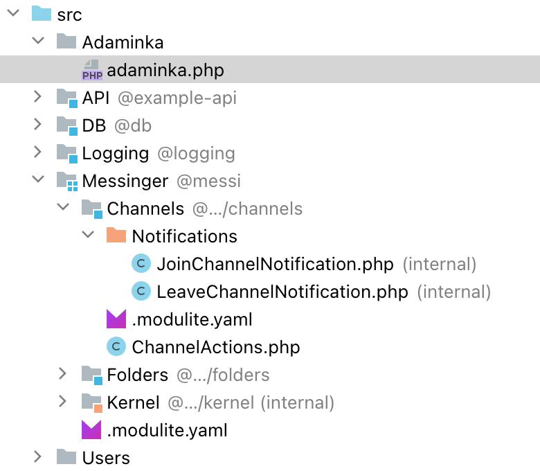
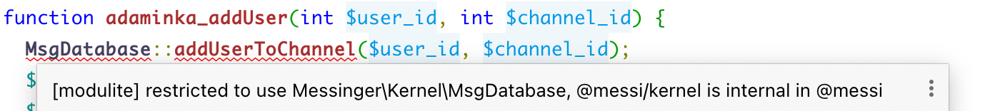
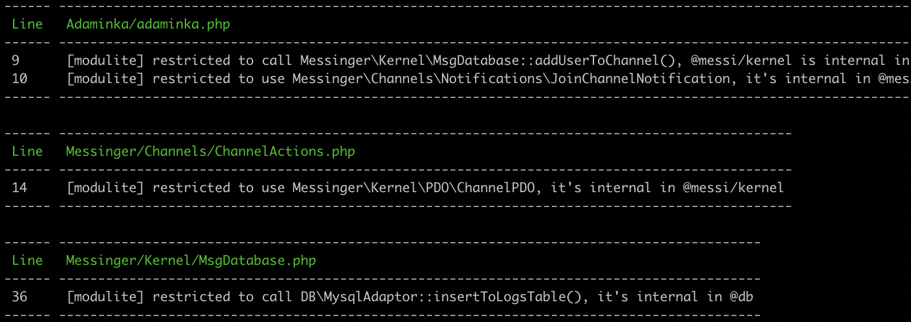
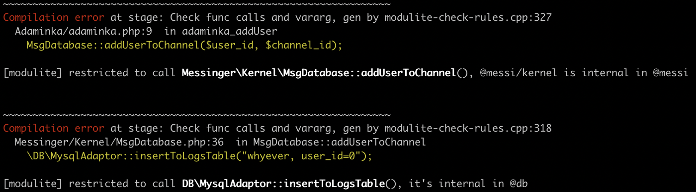
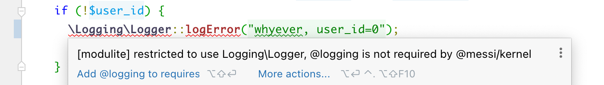
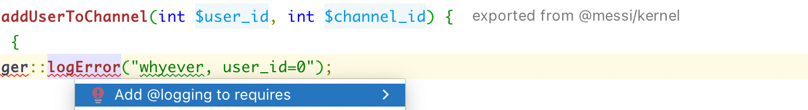
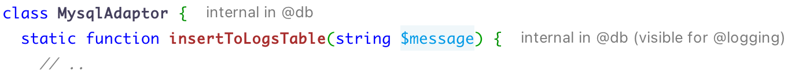

# modulite-example-project

Modulite is a conception that **brings modules into the PHP language**.
PHP does not have native modules (internal classes, private namespaces, explicit exports), 
and Modulite tries to eliminate this drawback.

This example project contains some Modulite errors, detected by IDE, PHPStan, and KPHP.

**Tip**. If you are unfamiliar with Modulite, consider a [PHPStorm plugin](https://github.com/VKCOM/modulite)
and a [landing page (in Russian)](https://vkcom.github.io/modulite/).


## How to use this example

Just clone this repo and install Composer dependencies:
```bash
git clone git@github.com:VKCOM/modulite-example-project.git
cd modulite-example-project
composer install
```


### Modulite errors in PHPStorm

Install the Modulite plugin from a marketplace in IDE (Settings > Plugins > type "Modulite" > install).

Open this project in PHPStorm. You'll see "@names" near some folders:



Navigate to `src/Adaminka/adaminka.php`, you'll see a couple of errors:




### Modulite errors in PHPStan

In console, execute
```bash
vendor/bin/phpstan analyze
```

You'll see all 4 errors:




### Modulite errors in KPHP

Install [KPHP](https://github.com/VKCOM/kphp), so that you have a `kphp2cpp` command.
```bash
export KPHP_ENABLE_MODULITE=1
kphp2cpp src/index.php -I src
```

You'll see the same 4 errors (here are top 2 on a screenshot):




## Fix errors in PHP code

Find a function `adaminka_addUser()`. The author tried to add a user to a channel, but did it incorrectly. He should have used public API, `ChannelActions::addUserSkipRightsCheck()`. Modify the function body:

```diff
- MsgDatabase::addUserToChannel($user_id, $channel_id);
- $n = new JoinChannelNotification('you were added by admin');
- $n->send($user_id);
+ ChannelActions::addUserSkipRightsCheck($user_id, $channel_id, 'you were added by admin');
```

Find a function `ChannelActions::createChannel()`. The author created a `ChannelPDO` object, but it's internal in kernel, we can't access it from there. He should not have called `insertToChannelsTable()`. He should have called `createChannelByName()`, but he just didn't know about it, apparently. 

```diff
- $pdo = new ChannelPDO();
- $pdo->name = $name;
- MsgDatabase::insertToChannelsTable($pdo);
+ MsgDatabase::createChannelByName($name);
```

Find a function `MsgDatabase::addUserToChannel()`. The author tried to log an unexpected situation, but again, `DB\MysqlAdaptor` is an internal API of `@db`. He should have used another method of logging — probably, `Logger::logError()`.

```diff
- \DB\MysqlAdaptor::insertToLogsTable("whyever, user_id=0");
+ \Logging\Logger::logError("whyever, user_id=0");
```

Replace the call as above. But here occurs another error:



We couldn't use `DB\MysqlAdaptor`, because it was an internal symbol. Here we can't use `Logging\Logger`, because we didn't add a `@logging` dependency. Besides internal symbols, Modulite also demands you to explicitly specify symbols you depend on. If you use symbols from `@logging`, you should require it, otherwise, you get an error (in PHPStan and KPHP also, try).

Just use an intention "add @logging to requires":



It modifies `Kernel/.modulite.yaml` file. So, a reviewer will see that you've added a dependency. Any time you want to know what external code you depend on, just look at yaml file:
```yaml
require:
  - "@db"
  - "@logging"
```

**Now, all the code is correct. Both PHPStan and KPHP will show zero errors.**


## A note for attentive readers

Take a look at `Logger::logError()`:

```php
// todo implement a better way for logging; now, just insert to MySQL
\DB\MysqlAdaptor::insertToLogsTable("error: $message");
```

A comment informs us that it's a temporary solution that should be rewritten. Now it's done via `MysqlAdaptor`. 

But how? When we called `MysqlAdaptor`, we got an error.

That's because of a special rule in `DB/.modulite.yaml`:
```yaml
allow-internal-access:
  "@logging":
    - "MysqlAdaptor::insertToLogsTable()"
```

As an exception, `@db` allows `@logging` to call that function. Only `@logging`, no one else. By the way, an editor also shows this info:


